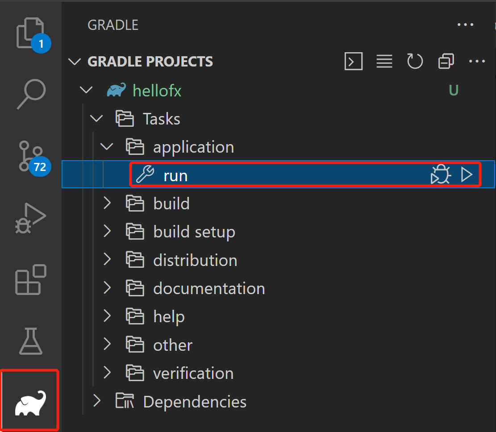

## Non-modular samples for Visual Studio Code

JavaFX 17 samples to run from Visual Studio Code with different options and build tools.

Version Visual Studio Code: 1.63.0 or higher.

Download [JDK 11 or later](http://jdk.java.net/) for your operating system. Make sure `JAVA_HOME` is properly set to the JDK installation directory.

### Gradle

For the first time only:

- Make sure you have installed following extensions in your Visual Studio Code:
  - [Extension Pack for Java](https://marketplace.visualstudio.com/items?itemName=vscjava.vscode-java-pack)
  - [Gradle for Java](https://marketplace.visualstudio.com/items?itemName=vscjava.vscode-gradle)

- Clone the sample, open the folder `hellofx` in Visual Studio Code.

To run the JavaFX application, you can open the `Gradle Projects` explorer, expand `hellofx` > `Tasks` > `application` and run the Gradle task: `run`

Or alternatively run from terminal:

On Linux or Mac run:

    cd IDE/VSCode/Non-Modular/Gradle/hellofx
    ./gradlew run

## Project Structure
`bin`: This directory contains the compiled class files and resources. The main directory under bin corresponds to the package structure (org.openjfx) of your Java classes. The compiled class files (*.class) and resource files (*.fxml, *.css) are located here.

`build`: This directory contains the build output generated by Gradle. It includes compiled classes, generated source files, resource files, distribution packages, and temporary build directories.

`build.gradle`: This file is the Gradle build configuration file for your project. It defines the project's dependencies, tasks, and other build settings.
