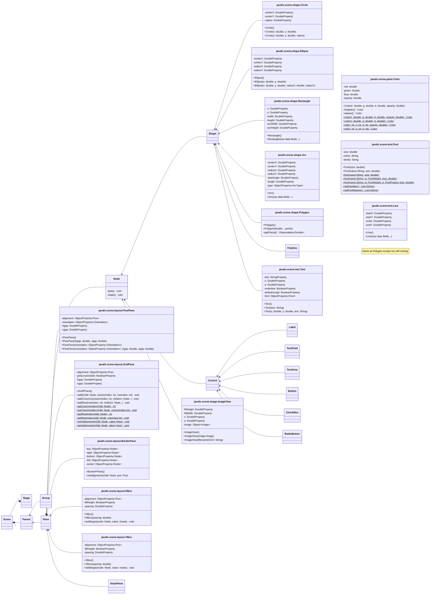

## Getting Started

Welcome to the VS Code Java world. Here is a guideline to help you get started to write Java code in Visual Studio Code.

## Folder Structure

The workspace contains two folders by default, where:

- `src`: the folder to maintain sources
- `lib`: the folder to maintain dependencies

Meanwhile, the compiled output files will be generated in the `bin` folder by default.

> If you want to customize the folder structure, open `.vscode/settings.json` and update the related settings there.

## Dependency Management

The `JAVA PROJECTS` view allows you to manage your dependencies. More details can be found [here](https://github.com/microsoft/vscode-java-dependency#manage-dependencies).

## Non-modular samples for Visual Studio Code

JavaFX 17 samples to run from Visual Studio Code with different options and build tools.

Version Visual Studio Code: 1.63.0 or higher.

Download [JDK 11 or later](http://jdk.java.net/) for your operating system. Make sure `JAVA_HOME` is properly set to the JDK installation directory.

### Java

For the first time only:

- Download [JavaFX SDK](https://gluonhq.com/products/javafx/) for your operating 
system and unzip to a desired location.

- Make sure you have the [Extension Pack for Java](https://marketplace.visualstudio.com/items?itemName=vscjava.vscode-java-pack) installed in your Visual Studio Code.

- Open `.vscode/settings.json`, replace the `<JavaFX_lib_path>` to you JavaFX lib folder.

- Open `.vscode/launch.json`, replace the `<JavaFX_lib_path>` to you JavaFX lib folder.

#### Run the JavaFX Application

To run the JavaFX Application, open left side `Run and Debug` panel -> `Launch App`.

